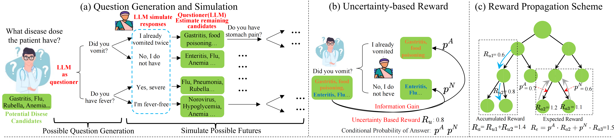

# Uncertainty of Thought (UoT)

Uncertainty of Thought (UoT) is a novel algorithm to augment large language models with the ability to actively seek information by asking effective questions.

## Setup
1. Install `uot` package
```bash
git clone https://github.com/ChorlingLau/Uncertainty-of-Thought.git
cd Uncertainty-of-Thought
pip install -r requirements.txt
pip install -e .
```
2. Set up API keys (if require) and store in environment variable
   
    | Model                 | Variable         | Source                                |
    |-----------------------|------------------|---------------------------------------|
    | llama-2-70b-chat      | TOGETHER_API_KEY | [Together](https://api.together.xyz/) |
    | cohere                | COHERE_API_KEY   | [Cohere](https://cohere.com/)         |
    | palm-2                | PALM2_API_KEY    | [Google AI](https://ai.google.dev/)   |
    | claude-2              | CLAUDE2_API_KEY  | [AIProxy](https://aiproxy.io/)        |
    | gpt-3.5-turbo / gpt-4 | OPENAI_API_KEY   | [OpenAI](https://openai.com/)         |
    
    To set up other models, see and modify `src/uot/models.py`, and add new choices to parameter `--guesser_model` in `run.py`.
3. install dataset [here](https://drive.google.com/drive/folders/1QhhsPinylvbgm52zX4VjwiKDxAgPvyVR?usp=sharing) and put files under `src/uot/data/`


## Use
Run experiments via `run.py`, which implements the UoT algorithm, as well as the naive prompting method. Arguments are as follows:

- `--guesser_model` (choices=[`gpt-4`, `gpt-3.5-turbo`, `claude-2`, `palm-2`, `cohere`, `llama-2-70b-chat`]): The name of model used to plan and ask questions
- `--temperature`: Parameter for calling guesser model.
- `--examiner_model`: The name of model used to provide environment feedback. Fixed to be `gpt-4` currently.
- `--task` and `--dataset`: Select the corresponding task name and dataset according to the table below.
  
    | Description       | task  | dataset               |
    |-------------------|-------|-----------------------|
    | 20 Question Game  | `20q` | `bigbench` / `common` |
    | Medical Diagnosis | `md`  | `DX` / `MedDG`        |
    | Troubleshooting   | `tb`  | `FiaDial`             |

- `--task_start_index` and `--task_end_index`: Conduct experiment with [start, end) targets in selected dataset. (Default: entire dataset)
- `--naive_run`: If True, run with naive prompting method, otherwise UoT.
- `--inform`: If True, the guesser is given answer set. (Consider only when `--naive_run` is True) 
- `--reward_lambda`: Parameter $\lambda$ in uncertainty-based reward setting.
- `--n_extend_layers`: Parameter $J$ -- Number of simulation steps.
- `--n_potential_actions`: Parameter $N$ -- Number of candidate actions generated.
- `--n_pruned_nodes`: Max number of remaining nodes in each step.
  
  - If not prun, set it to 0;
  - If prun and remain exact number of nodes, set it > 0 (e.g. `10`: Each step has a maximum of 10 nodes, $M$ or $U$, remaining);
  - If prun and remain a certain proportion of nodes, set it < 0 (e.g. `-0.5`: The remaining 50% of nodes in each step).
- `--expected_action_tokens`: Max tokens not to call `gpt-3.5-turbo` model simplifying the guesser's selected action.
- `--expected_target_tokens`: Max tokens for each target name. Used to predict and set the `max_tokens` when calling guesser model.

## Implement Note

- The root of UoT (stored in `roots/`) with the same setting will be loaded by default. And broken root file do cause error. Thus, if some errors occur when rerunning an experiment, you can try deleting the related root file.

## Citation
Please cite the associated paper and star this repository if you find UoT interesting or useful in your work. Your support is greatly appreciated! Don't hesitate to open an issue if you have any questions.
```bibtex
@misc{}
```

