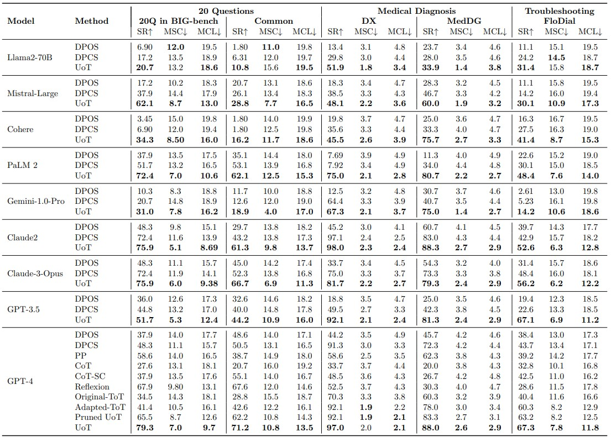

# Uncertainty of Thought (UoT)

Uncertainty of Thought (UoT) is a novel algorithm to augment large language models with the ability to actively seek information by asking effective questions.

We tested on two categories of models: open-source (Llama-2-70B) and closed-source commercial (other models). The results showed that UoT achieves an average performance improvement of **57.8%** in the rate of successful task completion across multiple LLMs compared with direct prompting, and also improves efficiency (i.e., the number of questions needed to complete the task).



To increase the number of items, we focus on the open-set scenario where the possibility space is unknown rather than predefined. Within this context, the number of items can increase by considering it as an infinite space, due to the lack of constraints. 


- In medical diagnosis and troubleshooting, initial patient or customer symptom descriptions help form an initial set of possibilities. However, in the game of 20 Questions, with limited early information, setting possibilities too soon may lead to wrong directions. Thus, for the first three rounds, DPOS method is used to collect more data. Afterward, the UoT approach **updates the possibilities each round** to improve the questioning strategy.
- For each dataset, we configure the size of the possibility set for each update round, setting them at 10, 10, 10, 5, 5 and 5, respectively.
- Compared to DPOS, the Uo'T method significantly improves performance, with enhancements of **54.9%** for GPT-3.5 and **21.1%** for GPT-4.

## Update

- \[20/04/2024\]: Supplement the code and experiment results in the open-set scenarios.
- \[19/03/2024\]: Supplement the experiment results of `Mistral-Large`, `Gemini-1.0-pro`, and `Claude-3-Opus` models.
- \[19/03/2024\]: Add the implementation for Gemini
- \[15/03/2024\]: Add the implementation for Gemma
- \[07/03/2024\]: Add the implementation for Mistral
- \[07/03/2024\]: Add the implementation for Claude-3


## Setup

1. Install `uot` package
```bash
git clone https://github.com/ChorlingLau/Uncertainty-of-Thought.git
cd Uncertainty-of-Thought
pip install -r requirements.txt
pip install -e .
```
2. Set up API keys (if require) and store in environment variable
   
    | Model                                 | Variable                                       | Source                                        |
    |---------------------------------------|------------------------------------------------|-----------------------------------------------|
    | llama-2-70b-chat                      | TOGETHER_API_KEY                               | [Together](https://api.together.xyz/)         |
    | cohere                                | COHERE_API_KEY                                 | [Cohere](https://cohere.com/)                 |
    | palm-2 (deprecated) / gemini-1.0-pro  | GOOGLE_API_KEY                                 | [Google AI](https://ai.google.dev/)           |
    | claude-2 (`_claude-2`)                | CLAUDE2_API_KEY                                | [AIProxy](https://aiproxy.io/)                |
    | gpt-3.5-turbo / gpt-4                 | OPENAI_API_KEY                                 | [OpenAI](https://openai.com/)                 |
    | claude-3-\[opus/sonnet\]-20240229     | ANTHROPIC_API_KEY                              | [Anthropic](https://www.anthropic.com/claude) |
    | mistral-\[small/medium/large\]-latest | MISTRAL_API_KEY                                | [Mistral](https://docs.mistral.ai/)           |
    | Gemma                                 | -- (See [_Setup for Gemma_](#setup-for-gemma)) | [Gemma](https://ai.google.dev/gemma)          |
    
    For example (in CMD):
    ```bash
    export OPENAI_API_KEY=[your api key]
    ```

    To set up other models, see and modify `src/uot/models.py`, and add new choices to parameter `--guesser_model` in `run.py`.
3. install dataset [here](https://drive.google.com/drive/folders/1QhhsPinylvbgm52zX4VjwiKDxAgPvyVR?usp=sharing) and put files under `src/uot/data/`


### Setup for Gemma

- Register a Kaggle account and request license for [Gemma](https://www.kaggle.com/models/google/gemma/frameworks/pyTorch/variations/7b) 

- Install dependencies and the model implementation
```
pip install -q -U torch immutabledict sentencepiece

cd src/uot
git clone https://github.com/google/gemma_pytorch.git
# NOTE: clone the repo to replace the empty directory - gemma_pytorch
```

For further details, follow the [official guidance](https://ai.google.dev/gemma/docs/pytorch_gemma) to prepare the environment and code of Gemma. Related code for downloading models and complete chats are located in `src/uot/model_gemma.py`.

## Use
Run experiments via `run.py`, which implements the UoT algorithm, as well as the naive prompting method. Arguments are as follows:

- `--guesser_model`: The name of model used to plan and ask questions

- `--temperature`: Parameter for calling guesser model.

- `--examiner_model`: The name of model used to provide environment feedback. Fixed to be `gpt-4` currently.

- `--task` and `--dataset`: Select the corresponding task name and dataset according to the table below.

    | Description       | task  | dataset               |
    |-------------------|-------|-----------------------|
    | 20 Question Game  | `20q` | `bigbench` / `common` |
    | Medical Diagnosis | `md`  | `DX` / `MedDG`        |
    | Troubleshooting   | `tb`  | `FiaDial`             |

- `--task_start_index` and `--task_end_index`: Conduct experiment with [start, end) targets in selected dataset. (Default: entire dataset)

- `--open_set_size`: Size of the possibility set after updating for open-set setting. (Default: -1, unable open-set setting)

- `--size_to_renew`: When the size of the possibility set is less than this value, update the possibility set to the size of `--open_set_size`. (Consider only when `--open_set_size` > 0) 

- `--n_pre_ask`: Number of DPOS rounds at the beginning. (Consider only when `--open_set_size` > 0 and self-report disable) 

- `--naive_run`: If True, run with naive prompting method, otherwise UoT.

- `--inform`: If True, the guesser is given answer set. (Consider only when `--naive_run` is True) 

- `--reward_lambda`: Parameter $\lambda$ in uncertainty-based reward setting.

- `--n_extend_layers`: Parameter $J$ -- Number of simulation steps.

- `--n_potential_actions`: Parameter $N$ -- Number of candidate actions generated.

- `--n_pruned_nodes`: Max number of remaining nodes in each step.

  - If not prun, set it to 0;
  - If prun and remain exact number of nodes, set it > 0 (e.g. `10`: Each step has a maximum of 10 nodes, $M$ or $U$, remaining);
  - If prun and remain a certain proportion of nodes, set it < 0 (e.g. `-0.5`: The remaining 50% of nodes in each step).

- `--expected_action_tokens`: Max tokens not to call `gpt-3.5-turbo` model simplifying the guesser's selected action.

- `--expected_target_tokens`: Max tokens for each target name. Used to predict and set the `max_tokens` when calling guesser model.

## Implement Note

- The root of UoT (stored in `roots/`) with the same setting will be loaded by default. And broken root file do cause error. Thus, if some errors occur when rerunning an experiment, you can try deleting the related root file.

## Citation
Please cite the associated paper and star this repository if you find UoT interesting or useful in your work. Your support is greatly appreciated! Don't hesitate to open an issue if you have any questions.
```bibtex
@misc{2402.03271,
Author = {Zhiyuan Hu and Chumin Liu and Xidong Feng and Yilun Zhao and See-Kiong Ng and Anh Tuan Luu and Junxian He and Pang Wei Koh and Bryan Hooi},
Title = {Uncertainty of Thoughts: Uncertainty-Aware Planning Enhances Information Seeking in Large Language Models},
Year = {2024}
```

